# 모두의 커머스

모두의 채팅과 같은 **모두 계정**으로 로그인하는 커머스입니다. 저장소는 세 부분입니다.

- `web/` — 커머스 화면 전부(React + Vite). Android 앱의 WebView 가 열고, 브라우저에서도 열립니다. 실험 단계라 화면을 빨리 바꿔 보려고 웹으로 둡니다. 자세한 건 `web/README.md`.
- `android/modu_commerce` — Android 껍데기(Kotlin/Compose): 초기 화면 → 로그인(모두 계정 SSO 또는 Google) → **WebView**. 토큰은 `window.ModuApp` 브리지로 웹에 넘기고, 만료되면 refresh 토큰으로 갱신하며, 갱신도 실패하면 로그인 화면으로 돌아갑니다.
- `backend/commerce-service` — 카탈로그·장바구니·주문 API.

## 모두의 커머스 어플리케이션

| 시작 화면 | 로그인 | 모두 계정으로 로그인 | 홈 |
| :--------: | :--------: | :--------: | :--------: |
||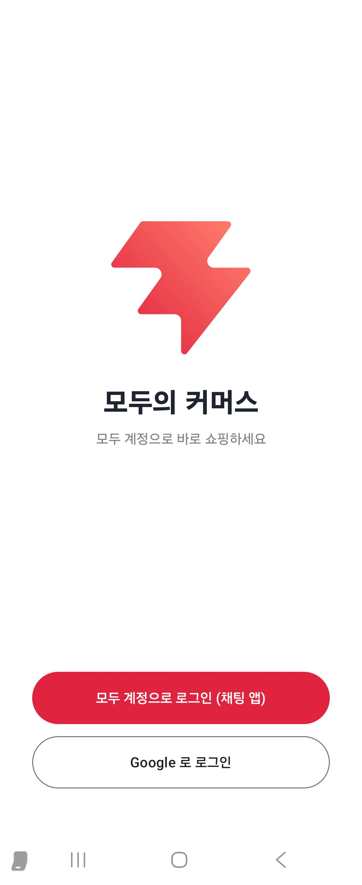|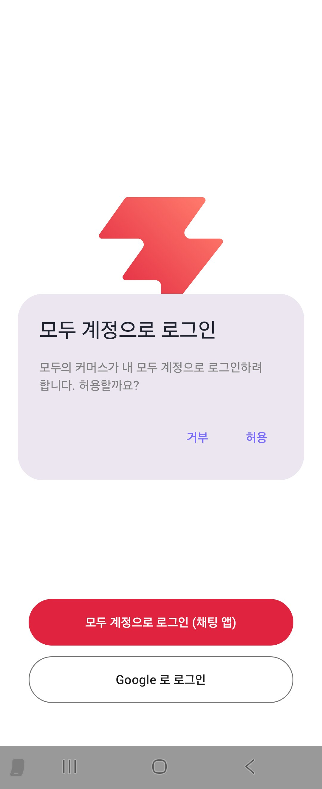|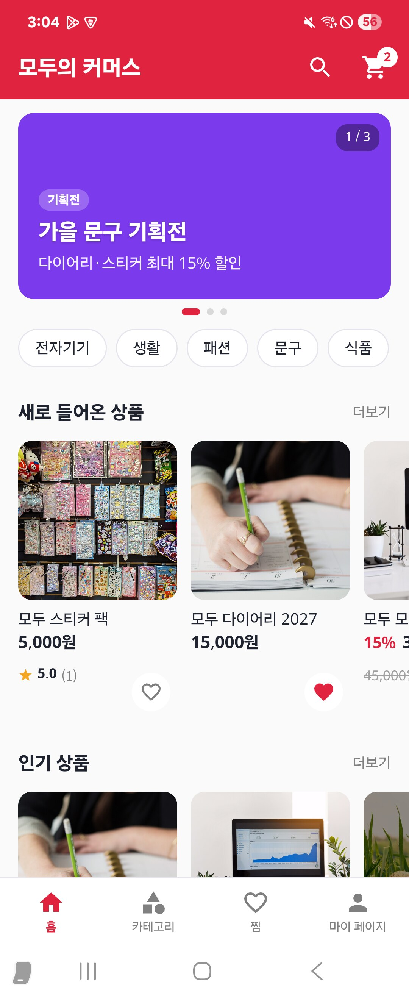|

| 카테고리 | 카테고리 상품 | 상품 상세 | 상품 리뷰 |
| :--------: | :--------: | :--------: | :--------: |
|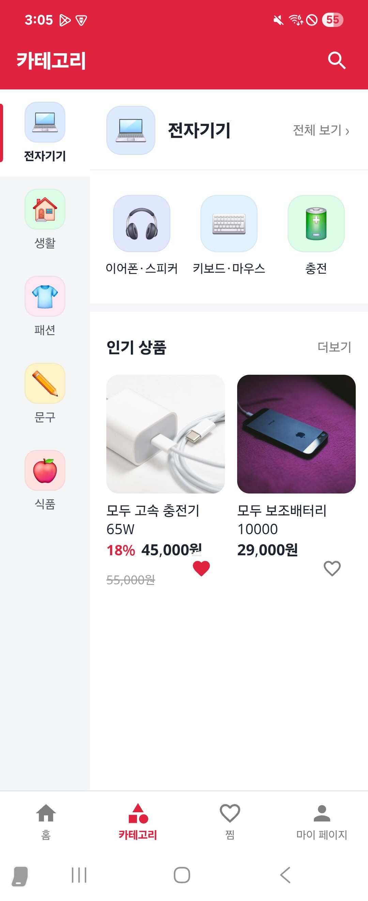|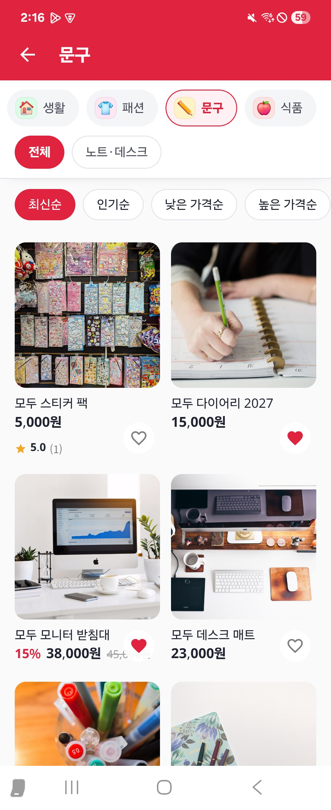|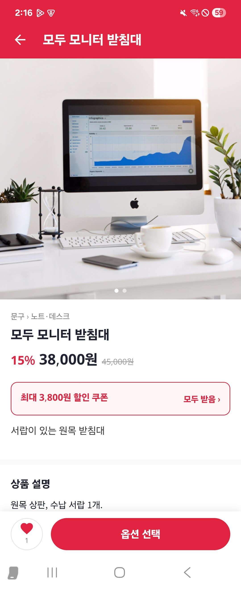|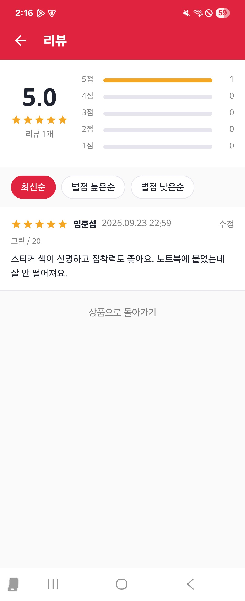|

| 장바구니 | 주문서 | 주문 상세 | 마이페이지 |
| :--------: | :--------: | :--------: | :--------: |
|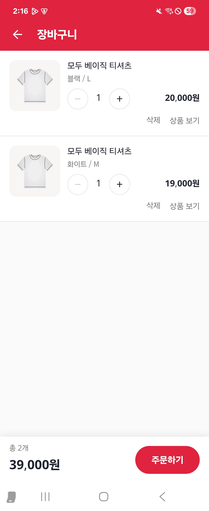|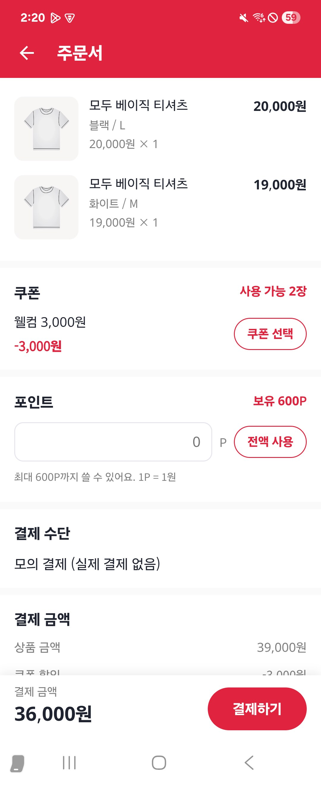|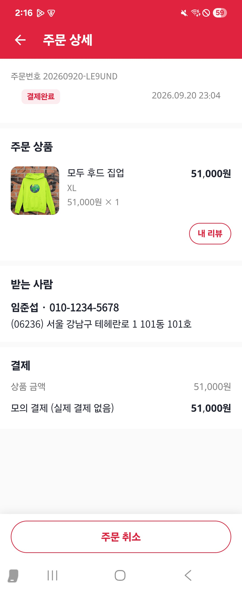|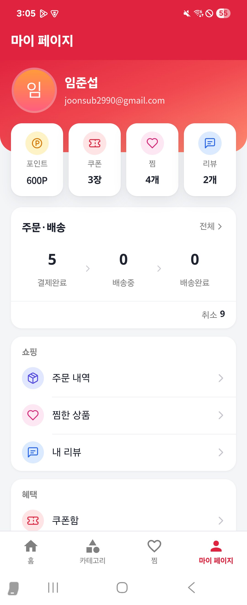|

| 쿠폰함 | 기획전 | 출석 체크 이벤트 | 쿠폰 받기 이벤트 |
| :--------: | :--------: | :--------: | :--------: |
|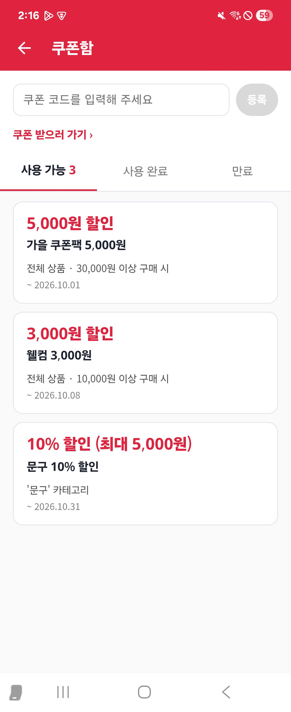|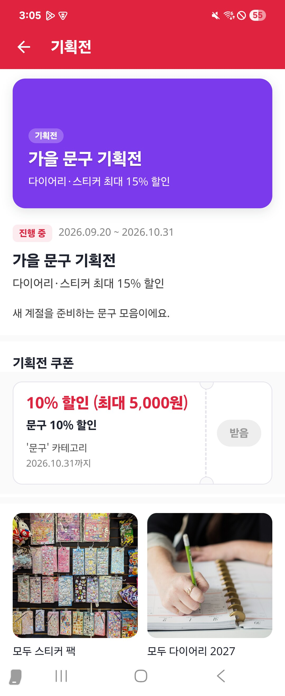|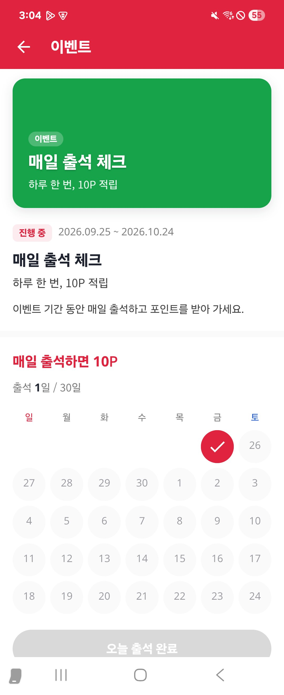|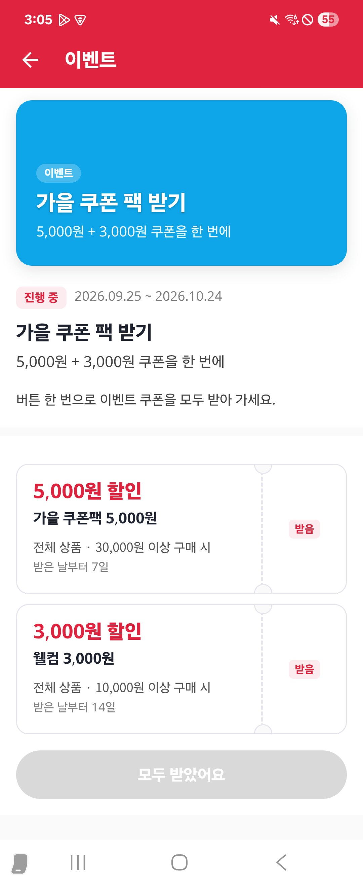|

---

## 실행

```bash
# 1) 웹 (Mac, LAN 에 열림)
cd web && npm install && npm run dev            # http://192.168.0.3:5174

# 1') 웹 배포본 (nginx, 릴리스 빌드가 여는 주소) — 백엔드 compose 의 서비스라 commerce-service 와 같이 뜬다
cd backend && docker compose up -d --build modu-commerce-web     # http://192.168.0.3:8082

# 2) Android 앱 — 디버그 빌드는 Vite dev 서버(:5174), 릴리스 빌드는 배포본(:8082)을 연다 (app/build.gradle.kts 의 WEB_URL)
cd android/modu_commerce
ANDROID_HOME=$HOME/Library/Android/sdk ./gradlew :app:testDebugUnitTest :app:assembleDebug
adb install -r app/build/outputs/apk/debug/app-debug.apk
```

- **모두 계정으로 로그인 (채팅 앱)**: 설치된 모두의 채팅 앱에 1회용 코드를 요청하고(PKCE), auth-service `/oauth2/token`(`sso_code` grant)으로 이 앱의 토큰을 받습니다. 채팅 앱과 같은 키(개발: 디버그 키)로 서명돼야 합니다.
- **Google 로 로그인**: 채팅 앱이 없을 때의 폴백. 구글 콘솔에 패키지 `com.example.moducommerce` 와 서명 SHA-1 이 등록돼 있어야 합니다.
- 게이트웨이 주소는 `app/build.gradle.kts` 의 `API_BASE_URL` 입니다.

## 커머스 서비스 (backend/commerce-service)

`~/Downloads/demo` 프로젝트 구조를 따른 Kotlin/Spring Boot 3.5 멀티모듈 서비스입니다.

- `commerce-api`: 실행 모듈.
  - 앱(`aud=modu-commerce`): `GET /api/v1/products`(`?q=` 검색), `GET /api/v1/products/{id}`.
  - 백오피스(`aud=modu-admin` + `roles` 에 `ROLE_ADMIN`): `GET /api-admin/v1/products?q=&page=&size=`, `GET·PUT·DELETE /api-admin/v1/products/{id}`, `POST /api-admin/v1/products`. 게이트웨이의 `/commerce-service/api-admin/**` 로 들어오며, commerce 도 토큰을 다시 검증합니다. 삭제는 `deleted_at` 만 채우는 소프트 삭제입니다.
  - 모든 토큰은 모두의 채팅 auth-service 가 발급한 RS256 토큰을 JWKS 로 검증합니다.
- `commerce-application`: 도메인/저장소/서비스. master(RW)·replica(RO) 데이터소스 분리, RO 는 DDL 을 실행하지 않음, QueryDSL(RO/RW 쿼리 팩토리). 시작 시 `products` 가 비어 있으면 샘플 카테고리·상품을 넣습니다. 상품 사진은 상품에 맞는 퍼블릭 도메인 사진(아래 "상품 사진 출처")이고, 목록에 없는 상품만 `picsum.photos` 의 seed 주소를 씁니다. 이미 상품이 들어 있는 DB 는 건드리지 않습니다.

```bash
cd backend/commerce-service
./gradlew test bootJar          # 테스트 37개, commerce-api/build/libs/commerce-api-0.0.1-SNAPSHOT.jar
cd .. && docker compose up -d --build   # commerce-service(8200) + modu-commerce-web(8082). mysql-commerce(3316)는 modu_infra(https://github.com/tear94fall/modu_infra, 이 저장소 옆에 clone)의 data 에서 먼저 띄운다
```

접속 정보는 `DB_MASTER_URL`/`DB_MASTER_USERNAME`/`DB_MASTER_PASSWORD`(선택 `DB_REPLICA_*`), 토큰 검증은 `MODU_OAUTH_ISSUER`/`MODU_OAUTH_JWKS_URI` 환경변수로 바꿉니다. 커머스 앱은 로그인 후 `COMMERCE_API_URL`(`app/build.gradle`) 로 상품 목록을 불러옵니다.

## 상품 사진 출처

샘플 상품 사진은 [Openverse](https://openverse.org) 에서 고른 CC0 · 퍼블릭 도메인(PDM) 사진입니다. 출처 표시 의무는 없지만 원본을 남겨 둡니다. 앱은 원본 CDN 주소를 그대로 씁니다(`ProductSeeder.SAMPLE_IMAGES`).

| 상품 | 출처 | 라이선스 | 원본 |
| --- | --- | --- | --- |
| 모두 무선 이어폰 | flickr | PDM | [superbsavers](https://www.flickr.com/photos/195657162@N08/52063601444) |
| 모두 무선 이어폰 | flickr | PDM | [maniban01](https://www.flickr.com/photos/189514139@N06/50168607566) |
| 모두 블루투스 스피커 | rawpixel | CC0 | [원본](https://www.rawpixel.com/image/5975218/closeup-black-bluetooth-speaker) |
| 모두 블루투스 스피커 | rawpixel | CC0 | [원본](https://www.rawpixel.com/image/5915300/image-background-public-domain-technology) |
| 모두 기계식 키보드 | stocksnap | CC0 | [Bridget Braun](https://stocksnap.io/photo/iphone-keyboard-R7GVMRJWW9) |
| 모두 기계식 키보드 | stocksnap | CC0 | [Jaroslaw%20Puszczy%u0144ski](https://stocksnap.io/photo/keyboard-computer-FFPJ3S8U5Y) |
| 모두 무선 마우스 | wordpress | CC0 | [Ajith R N](https://wordpress.org/photos/photo/8756533cf9/) |
| 모두 무선 마우스 | rawpixel | CC0 | [원본](https://www.rawpixel.com/image/6020645/photo-image-public-domain-hand-person) |
| 모두 고속 충전기 65W | rawpixel | CC0 | [원본](https://www.rawpixel.com/image/5923136/photo-image-phone-public-domain-white) |
| 모두 고속 충전기 65W | rawpixel | CC0 | [원본](https://www.rawpixel.com/image/5910187/photo-image-phone-public-domain-technology) |
| 모두 보조배터리 10000 | stocksnap | CC0 | [Freestocks.org](https://stocksnap.io/photo/iphone-mobile-1KQALMC305) |
| 모두 보조배터리 10000 | flickr | CC0 | [cogdogblog](https://www.flickr.com/photos/37996646802@N01/31300186927) |
| 모두 텀블러 500ml | stocksnap | CC0 | [Nathan Dumlao](https://stocksnap.io/photo/thermos-heater-Q9JPW18WWZ) |
| 모두 텀블러 500ml | stocksnap | CC0 | [Simon Migaj](https://stocksnap.io/photo/adventure-coffee-IB5PS7EDFG) |
| 모두 머그컵 세트 | stocksnap | CC0 | [Clem Onojeghuo](https://stocksnap.io/photo/coffee-mug-J6PXDIMIUU) |
| 모두 머그컵 세트 | flickr | PDM | [favorli](https://www.flickr.com/photos/147778363@N07/32903357261) |
| 모두 호텔 수건 4장 | rawpixel | CC0 | [원본](https://www.rawpixel.com/image/5922052/bath-towels-free-public-domain-cc0-photo) |
| 모두 호텔 수건 4장 | rawpixel | CC0 | [원본](https://www.rawpixel.com/image/5921967/bath-towels-free-public-domain-cc0-photo) |
| 모두 샤워 타월 | flickr | PDM | [hongking1](https://www.flickr.com/photos/197668716@N04/52676443903) |
| 모두 샤워 타월 | rawpixel | CC0 | [원본](https://www.rawpixel.com/image/6017422/bath-towel-free-public-domain-cc0-photo) |
| 모두 무드등 | stocksnap | CC0 | [Atilla Taskiran](https://stocksnap.io/photo/still-items-8ZYCJ5MGJI) |
| 모두 무드등 | stocksnap | CC0 | [Frank Oschatz](https://stocksnap.io/photo/office-desk-WDUTVSMPXQ) |
| 모두 디퓨저 | wikimedia | CC0 | [Alex Tang](https://commons.wikimedia.org/w/index.php?curid=56224537) |
| 모두 디퓨저 | flickr | CC0 | [Sulen Lee](https://www.flickr.com/photos/133369866@N05/17864691244) |
| 모두 데일리 백팩 | stocksnap | CC0 | [Cynthia del Rio](https://stocksnap.io/photo/white-bed-0JXUC43X55) |
| 모두 데일리 백팩 | stocksnap | CC0 | [Felix Russell-Saw](https://stocksnap.io/photo/yellow-backpack-LE23HHZVIF) |
| 모두 크로스백 | flickr | PDM | [niceleather](https://www.flickr.com/photos/130665648@N08/17281999865) |
| 모두 크로스백 | flickr | CC0 | [shop8447](https://www.flickr.com/photos/185514373@N06/49062061267) |
| 모두 베이직 티셔츠 | rawpixel | CC0 | [원본](https://www.rawpixel.com/image/9746837/image-people-pattern-illustrations) |
| 모두 베이직 티셔츠 | flickr | CC0 | [sarahstierch](https://www.flickr.com/photos/7633518@N08/54573341777) |
| 모두 후드 집업 | wikimedia | CC0 | [T Cells](https://commons.wikimedia.org/w/index.php?curid=102904540) |
| 모두 후드 집업 | flickr | CC0 | [Wonderlane](https://www.flickr.com/photos/71401718@N00/12358351054) |
| 모두 볼캡 | stocksnap | CC0 | [Lautaro Andreani](https://stocksnap.io/photo/cap-hat-RI84WJYDVA) |
| 모두 볼캡 | stocksnap | CC0 | [Studio 7042](https://stocksnap.io/photo/small-boy-QIJ4BAZL2D) |
| 모두 버킷햇 | stocksnap | CC0 | [Alex%20Bl%u0103jan](https://stocksnap.io/photo/straw-hat-R27ZN6PJ4S) |
| 모두 버킷햇 | flickr | CC0 | [Wonderlane](https://www.flickr.com/photos/71401718@N00/51694681673) |
| 모두 하드커버 노트 | stocksnap | CC0 | [Kristin Hardwick](https://stocksnap.io/photo/journal-desk-MFRLKOXJVH) |
| 모두 하드커버 노트 | stocksnap | CC0 | [Ian Schneider](https://stocksnap.io/photo/office-work-CH9EXU7YTW) |
| 모두 젤펜 5색 | stocksnap | CC0 | [Jeffrey Betts](https://stocksnap.io/photo/pens-pencils-7UES4TX4ZN) |
| 모두 젤펜 5색 | stocksnap | CC0 | [Tim Gouw](https://stocksnap.io/photo/pens-pencils-0V4MVUGT47) |
| 모두 데스크 매트 | stocksnap | CC0 | [Jeff Sheldon](https://stocksnap.io/photo/apple-mac-51CE04FEF9) |
| 모두 데스크 매트 | stocksnap | CC0 | [Andrew Pons](https://stocksnap.io/photo/mac-desktop-UCEBZORVVB) |
| 모두 모니터 받침대 | stocksnap | CC0 | [Serpstat](https://stocksnap.io/photo/seo-computer-959IURDRGJ) |
| 모두 모니터 받침대 | stocksnap | CC0 | [Volkan Olmez](https://stocksnap.io/photo/apple-mac-0061559E5D) |
| 모두 다이어리 2027 | stocksnap | CC0 | [Kristin Hardwick](https://stocksnap.io/photo/writing-hand-2FRRD2PUVA) |
| 모두 다이어리 2027 | stocksnap | CC0 | [Kristin Hardwick](https://stocksnap.io/photo/writing-hand-JTHDMAOGLD) |
| 모두 스티커 팩 | wikimedia | CC0 | [Reconrabbit](https://commons.wikimedia.org/w/index.php?curid=157271527) |
| 모두 스티커 팩 | stocksnap | CC0 | [Dan Gold](https://stocksnap.io/photo/stickers-kitchen-UD4G1NRANC) |
