# 모두의 커머스

## 모두의 커머스 어플리케이션

| 시작 화면 | 로그인 | 모두 계정으로 로그인 | 홈 |
| :--------: | :--------: | :--------: | :--------: |
||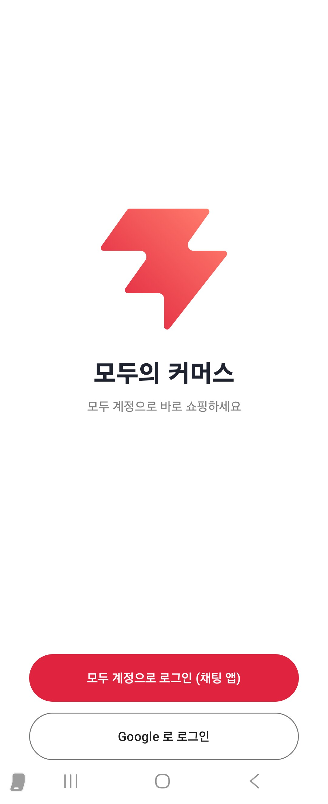|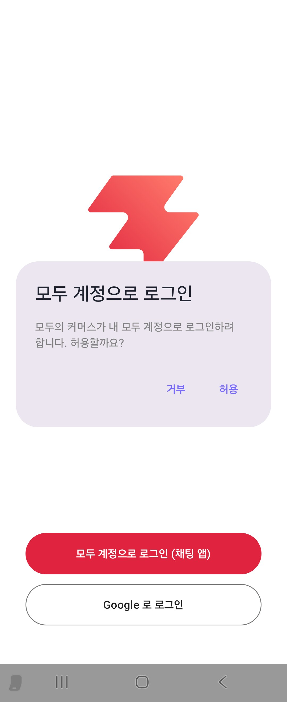|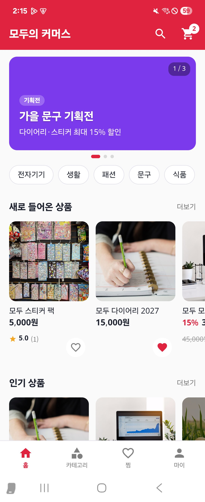|

| 카테고리 | 카테고리 상품 | 상품 상세 | 상품 리뷰 |
| :--------: | :--------: | :--------: | :--------: |
|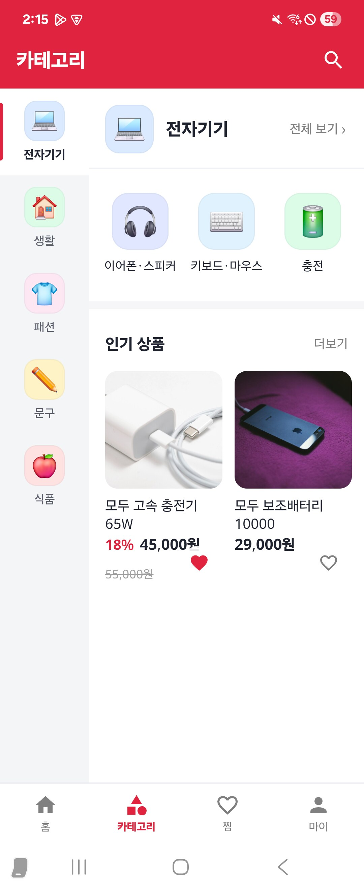|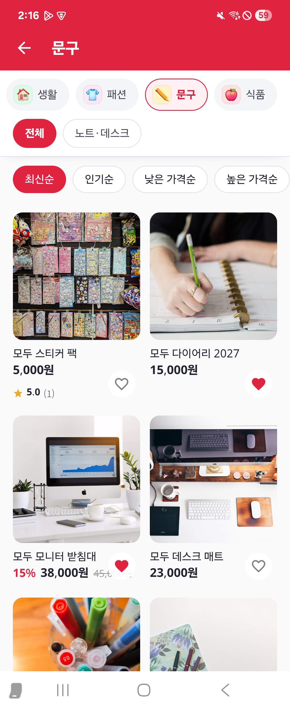|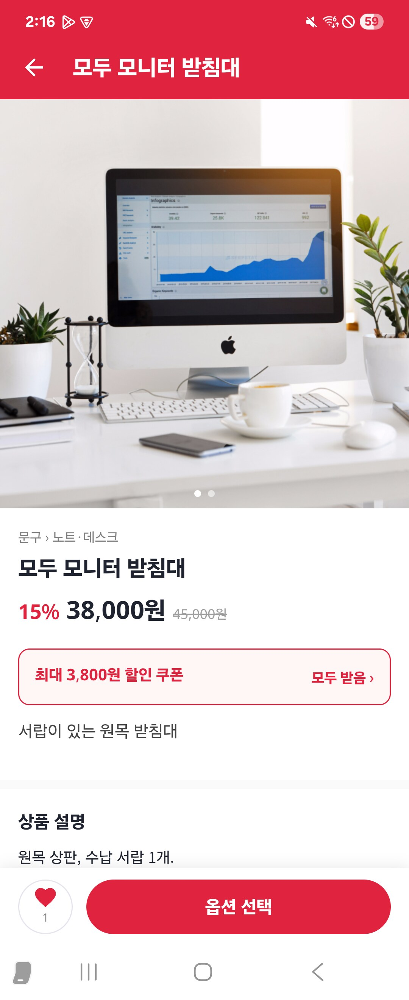|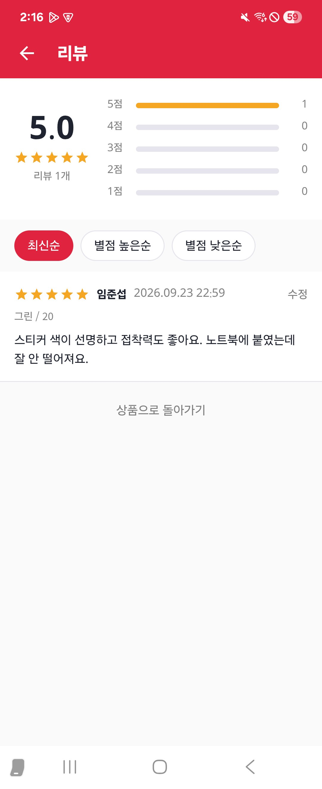|

| 장바구니 | 주문서 | 주문 상세 | 마이페이지 |
| :--------: | :--------: | :--------: | :--------: |
|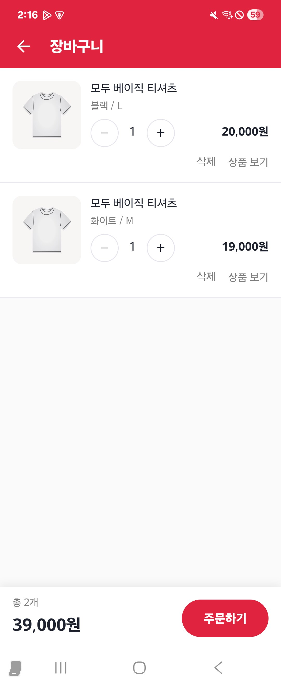|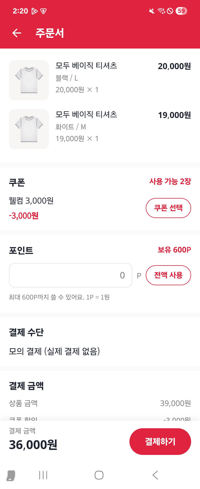|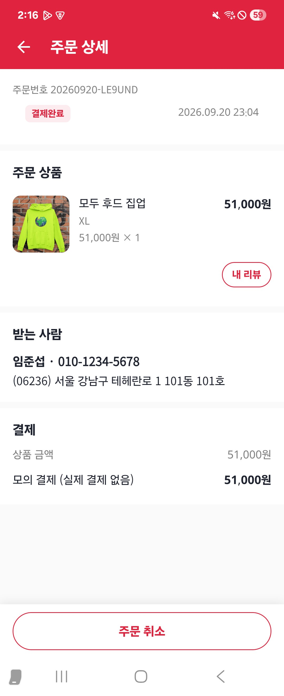|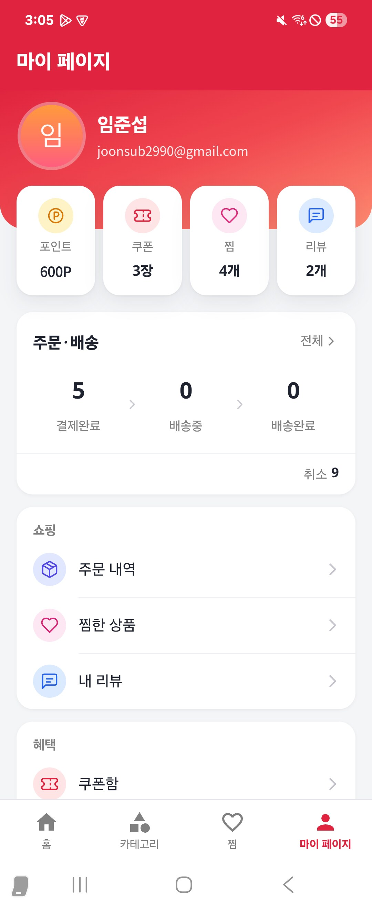|

| 쿠폰함 | 기획전 | 출석 체크 이벤트 | 쿠폰 받기 이벤트 |
| :--------: | :--------: | :--------: | :--------: |
|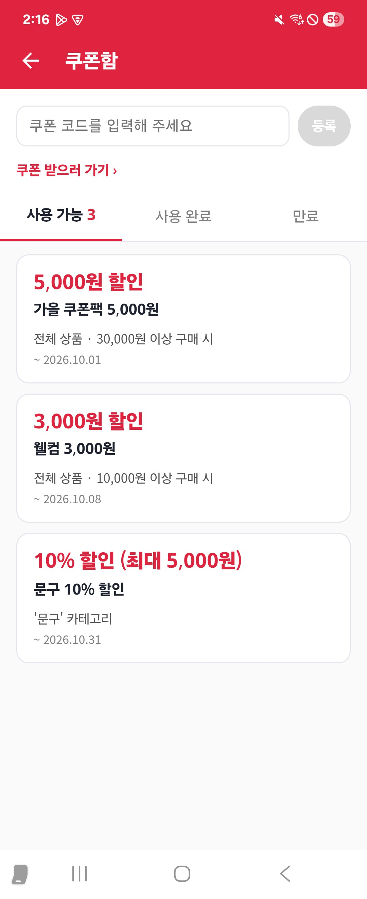|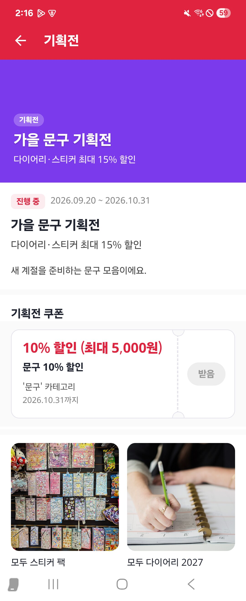|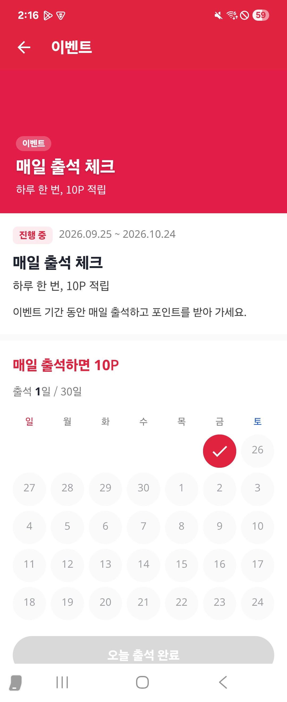|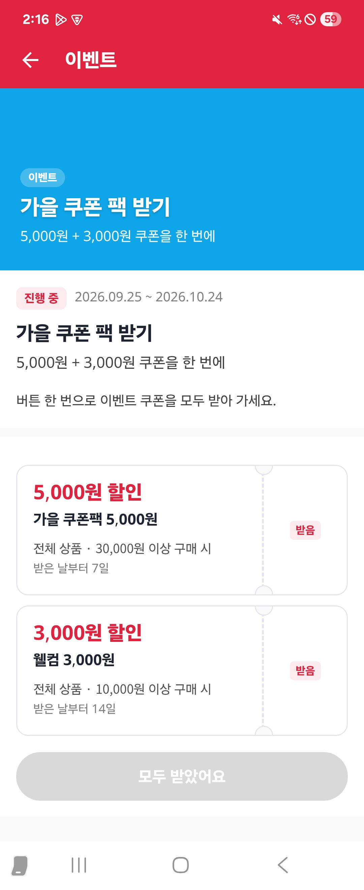|

---

## 주요 도메인 모델

### 커머스 도메인 모델 구조

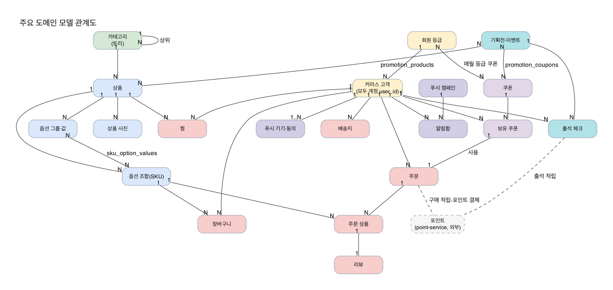

- **커머스 고객**은 모두 계정(`user_id`)으로 식별합니다. 회원 정보(이름·이메일·프로필)는 모두의 채팅 member-service 가 갖고, 커머스는 가입(약관 동의)·등급·주문 같은 커머스 쪽 데이터만 둡니다.
- **포인트**는 커머스 DB 에 없습니다. modu_chat 의 point-service(`modu-point` 스키마)가 원장을 갖고, 커머스는 내부 API 로 적립·사용·환불만 요청합니다.
- 다대다 관계(기획전–상품, 기획전–쿠폰, 옵션 값–SKU)는 모두의 채팅과 같은 원칙으로 연관 테이블(`promotion_products`, `promotion_coupons`, `sku_option_values`)을 두어 1대다·1대다로 풀었습니다. `@ManyToMany` 는 쓰지 않습니다.

### 설계 메모

- **외래 키는 두지 않습니다**: 운영 DB 에는 외래 키 제약이 없습니다(gh-ost 로 무중단 변경을 하기 위해, 아래 스키마 관리). 상품–SKU·주문–주문 상품처럼 같은 도메인 안의 관계(ERD 의 실선)도 id 만 저장하고, 무결성은 애플리케이션(유스케이스의 삭제 순서·검증)과 고아 행 점검 쿼리가 지킵니다. 테스트(H2)만 Hibernate 가 외래 키를 만들어 잘못된 삭제 순서를 잡아냅니다.
- **소프트 삭제**: `products`, `reviews`, `coupons`, `promotions` 는 `deleted_at` 만 채우고 행을 남깁니다(`@SQLRestriction`). 리뷰는 주문 상품당 한 건(`order_item_id` 유니크)입니다.
- **스냅샷 컬럼**: 주문 상품(`product_name`, `option_label`, `unit_price`), 리뷰(`product_name`, `author_name`), 주문(`recipient`, `address1`…)은 주문 시점 값을 복사해 둡니다. 원본이 바뀌어도 주문 내역은 그대로입니다.
- **시각**: 서버는 UTC `datetime(6)` 로 저장하고 앱이 한국 시간으로 바꿉니다. 기획전 기간·쿠폰 유효 기간·등급 산정 기간은 한국 달력 날짜(`date`)입니다.
- **읽기·쓰기 분리**: 쓰기는 `mysql-commerce`(소스), 읽기는 GTID 복제 레플리카 `mysql-commerce-replica` 에 SELECT 전용 계정(`commerce_ro`)으로 붙습니다. 쓰기 직후 다시 읽는 조회(장바구니·배송지·결제 직후 주문·가입 확인 등)는 소스에서 읽습니다.
- **스케줄러 잠금**: 월 등급 산정·구매 적립 재시도·푸시 캠페인 발송은 ShedLock(`shedlock` 테이블, rw 풀)으로 잠가 파드가 여러 개여도 한 곳에서만 돕니다.

### 스키마 관리

- `ddl-auto` 는 `validate` 입니다(`JPA_DDL_AUTO` 로 로컬 일회용 MySQL 에서만 `update`). 앱은 공용 DB 의 테이블을 만들거나 바꾸지 않고, 엔티티와 스키마가 어긋나면 기동 실패로 바로 드러납니다.
- 스키마 기준선과 변경 이력은 `modu_infra/data/mysql/schema` 에 있습니다. 엔티티를 바꾸면 거기에 DDL 을 같이 올립니다.
- 변경은 DBA 가 gh-ost 로 적용합니다(절차: `modu_infra/data/mysql/DBA.md`). 코드 배포는 스키마 적용 뒤에 합니다.
- 외래 키는 두지 않습니다. 정합성은 UseCase(삭제 순서·존재 검증)와 고아 행 점검 쿼리로 지킵니다.
- 테스트(H2)는 `update` 그대로라 Hibernate 가 외래 키를 만듭니다. `shedlock` 테이블만 `src/test/resources/schema-shedlock.sql` 로 만듭니다.

### ERD

실제 dev DB(`commerce` 스키마, MySQL 8.0)에서 뽑은 30개 테이블입니다. 실선은 같은 도메인 안의 관계, 점선은 다른 도메인의 id 를 저장하는 논리 관계이며 둘 다 DB 제약(외래 키)은 없습니다. `*` 는 NOT NULL 입니다. 도메인별로 나눠 그렸고 다른 도메인의 테이블은 회색 상자로 표시했습니다.

#### 상품·카테고리

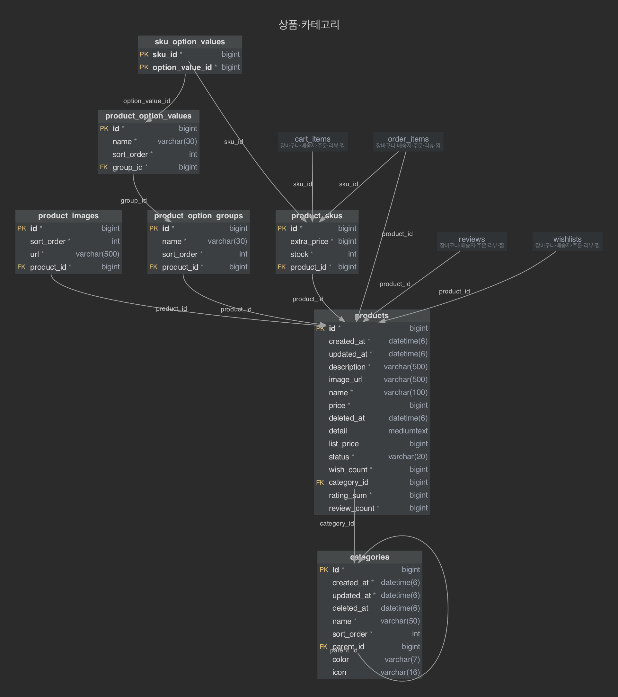

| 테이블 | 내용 |
|---|---|
| `categories` | 카테고리 트리(`parent_id` 자기 참조), 이모지 아이콘·색, 정렬 순서 |
| `products` | 상품. 판매가·정가·상태(SELLING/HIDDEN), 찜 수·리뷰 수·평점 합 캐시, 소프트 삭제(재고는 SKU 에) |
| `product_images` | 상품 사진 URL, 정렬 순서 |
| `product_option_groups` / `product_option_values` | 옵션 그룹(색상 등)과 값 |
| `product_skus` | 옵션 조합별 재고·추가 금액. 장바구니·주문은 SKU 단위 |
| `sku_option_values` | SKU–옵션 값 연관 테이블 |

#### 고객·회원 등급

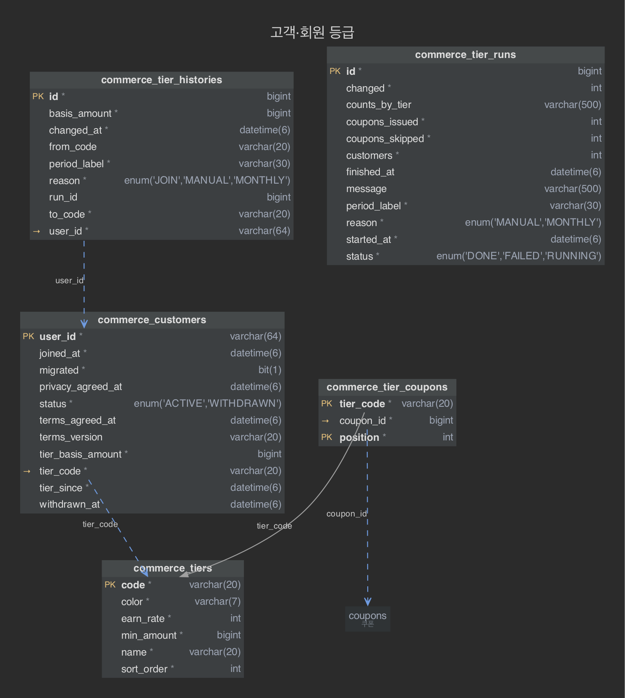

| 테이블 | 내용 |
|---|---|
| `commerce_customers` | 커머스 고객(PK `user_id` = 모두 계정). 가입·약관/개인정보 동의 시각·버전, 상태(ACTIVE/WITHDRAWN), 현재 등급과 산정 기준 금액, 이전 이용자 여부(`migrated`) |
| `commerce_tiers` | 등급 4단계(웰컴·실버·골드·VIP): 기준 금액, 적립률, 색 (어드민에서 수정) |
| `commerce_tier_coupons` | 등급별 매월 자동 발급 쿠폰 |
| `commerce_tier_histories` | 고객별 등급 변경 이력(가입/월 산정/수동, 기준 기간·금액) |
| `commerce_tier_runs` | 산정 실행 기록(월 1일 자동·수동): 고객 수, 변경 수, 등급별 인원, 쿠폰 발급/건너뜀 |

#### 장바구니·배송지·주문·리뷰·찜

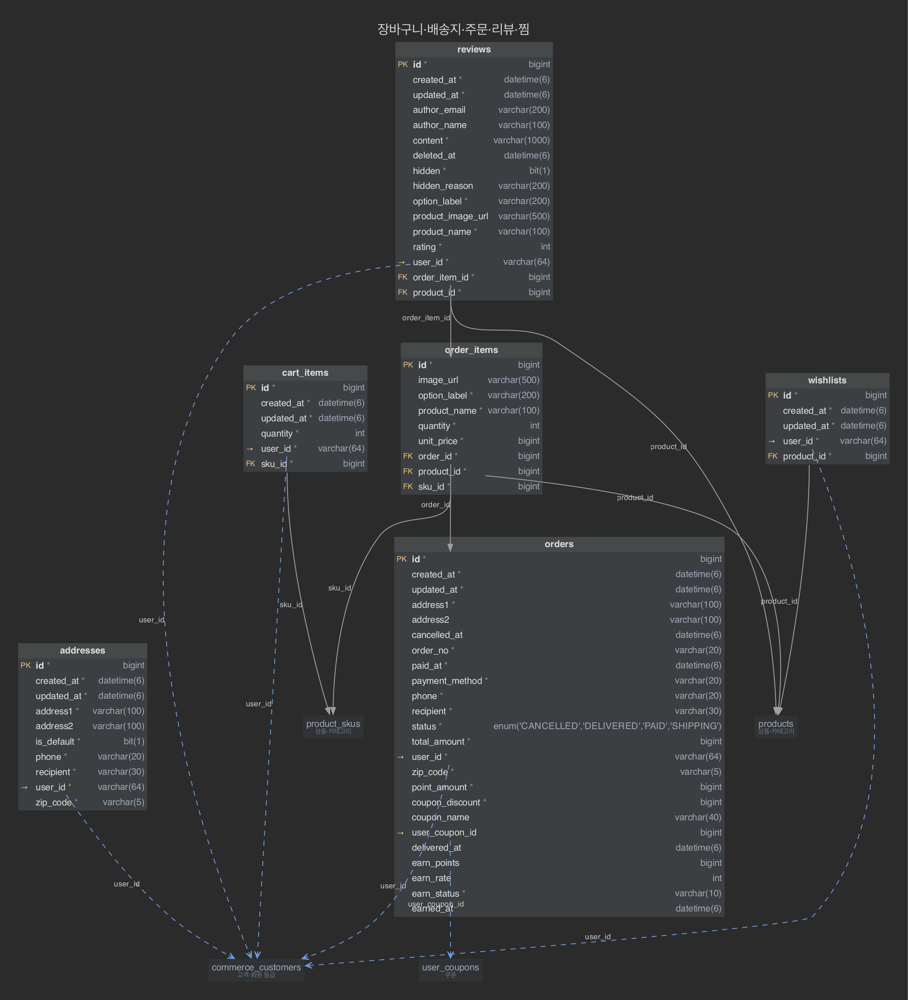

| 테이블 | 내용 |
|---|---|
| `cart_items` | 고객별 장바구니(SKU + 수량) |
| `addresses` | 배송지, 기본 배송지 표시 |
| `orders` | 주문. 상태(PAID→SHIPPING→DELIVERED / CANCELLED), 결제 금액·포인트 사용·쿠폰 할인, 배송 완료 시각, 구매 적립 상태(`earn_*`), 배송지 스냅샷 |
| `order_items` | 주문 상품(SKU·수량·단가 스냅샷) |
| `reviews` | 리뷰(주문 상품당 1건, 별점 1~5, 작성자 이름 스냅샷, 숨김/소프트 삭제) |
| `wishlists` | 찜(고객–상품) |

#### 쿠폰

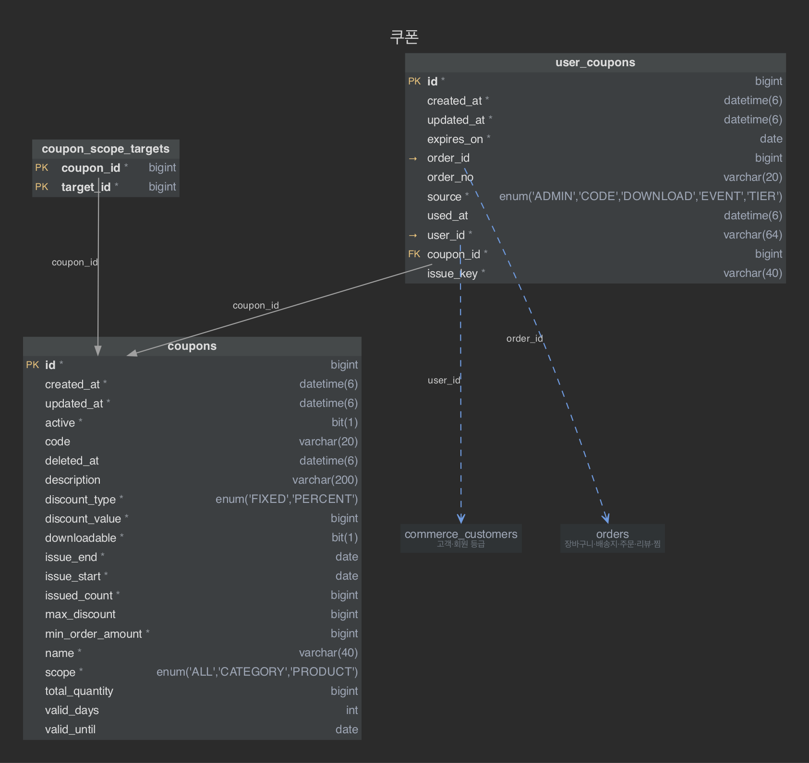

| 테이블 | 내용 |
|---|---|
| `coupons` | 쿠폰 정의: 정액/정률·최대 할인·최소 주문 금액, 적용 범위(전체/카테고리/상품), 발급 기간·유효 기간, 수량, 코드, 앱 노출 여부, 소프트 삭제 |
| `coupon_scope_targets` | 적용 범위가 카테고리/상품일 때 대상 id |
| `user_coupons` | 보유 쿠폰: 발급 경로(DOWNLOAD/CODE/ADMIN/EVENT/TIER), 만료일, 사용 주문, 발급 키(`issue_key` — 등급 쿠폰은 `tier:YYYY-MM` 으로 매월 새로 받음) |

#### 기획전·이벤트

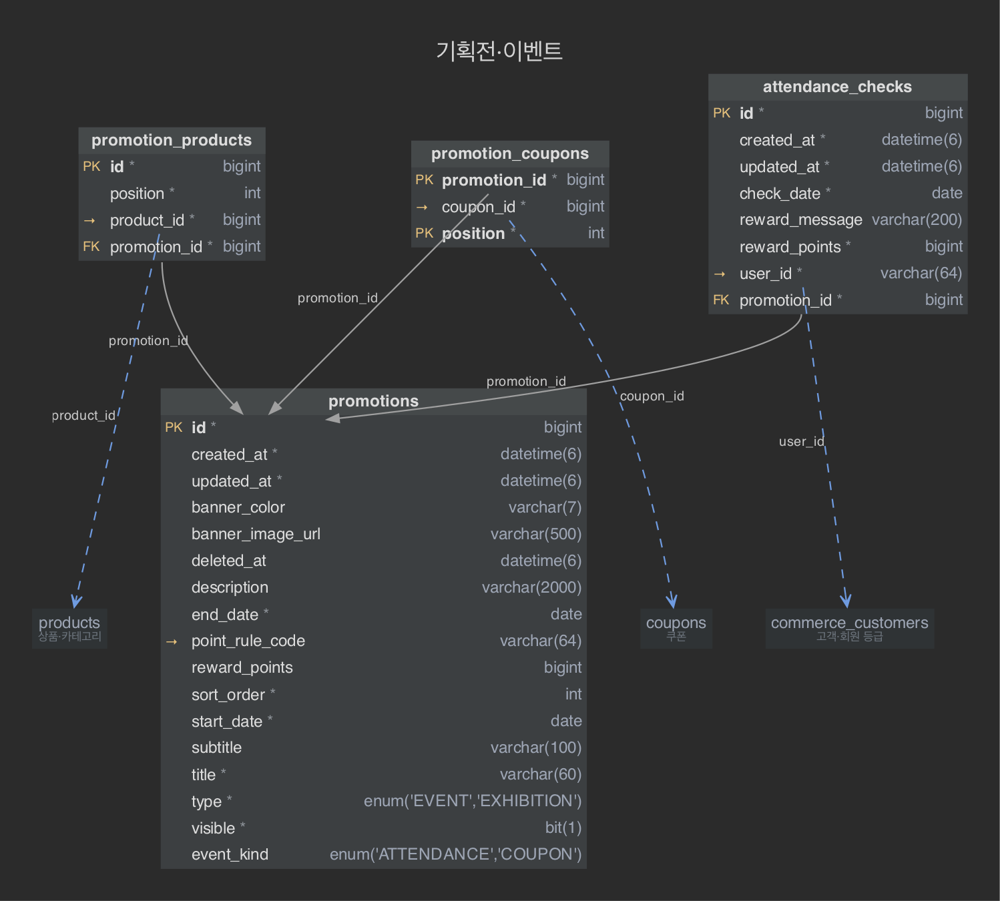

| 테이블 | 내용 |
|---|---|
| `promotions` | 기획전(EXHIBITION) 또는 이벤트(EVENT: 출석/쿠폰). 기간(한국 날짜), 배너 이미지·색, 노출 여부, 정렬, 출석 보상 포인트 규칙 |
| `promotion_products` / `promotion_coupons` | 기획전에 붙는 상품·쿠폰(연관 테이블, 순서 있음) |
| `attendance_checks` | 출석 체크(고객·이벤트·날짜 유니크), 적립 결과 |

#### 푸시

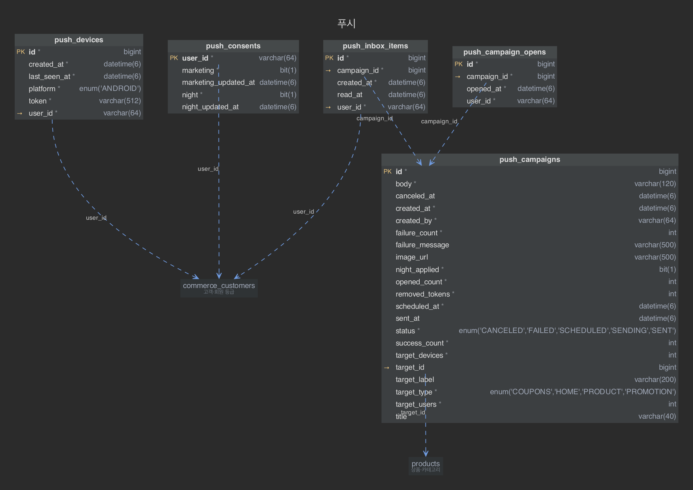

| 테이블 | 내용 |
|---|---|
| `push_devices` | 커머스 앱 기기 토큰(FCM, 토큰 유니크, 한 사람이 여러 기기) |
| `push_consents` | 혜택·이벤트 알림 동의, 야간 수신 동의와 각 변경 시각 |
| `push_campaigns` | 관리자 발송 캠페인: 내용·이미지·이동할 곳, 예약 시각, 상태(SCHEDULED/SENDING/SENT/CANCELED/FAILED), 발송·성공·실패·열어 봄 수 |
| `push_campaign_opens` | 캠페인을 눌러 들어온 기록(고객당 1회) |
| `push_inbox_items` | 앱 알림함(실제로 받은 사람마다 1건, 읽음 시각) |
